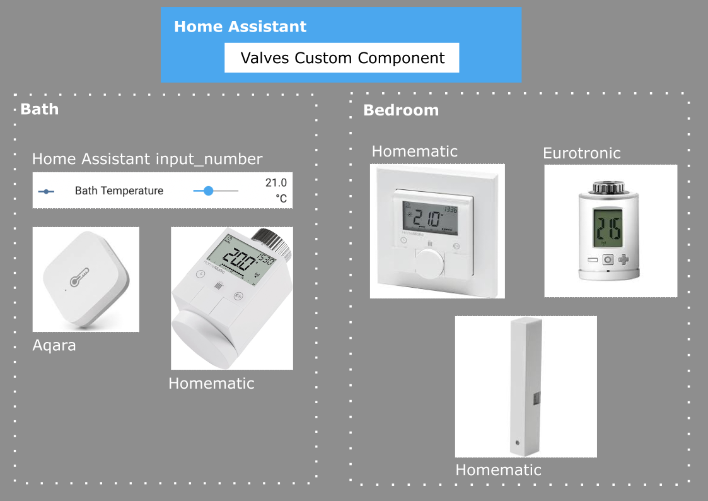

# Home Assistant Valves Custom Component

This [Home Assistant](https://www.home-assistant.io/) custom component
uses supported smart thermostatic radiator valves (TRVs) to directly
control their absolute valve position (i.e. 0%-100%).

The main features are:
* Vendor and platform independence - mix TRVs from Homematic or Eurotronic
  with room temperature sensors from e.g Aqara (Zigbee)
* Minimize valve adjustments to save battery live
* Minimize manual tweaking by using a machine learning algorithm to
  detect and adapt room and valve properties
* Support central heatings which only heat periodically
  (e.g. 30 minutes off, 30 minutes on). That's actually the main reason to
  start off the project

## Example Scenario
In this scenario you see the Valves custom component control TRVs
in different rooms with temperature sensors - devices can be from
different vendors.

## Basic Usage
Put this custom component to the folder `custom_components/valves` of
your Home Assistant config folder. Details can be found
[here](https://developers.home-assistant.io/docs/creating_integration_file_structure#where-home-assistant-looks-for-integrations).

You need to have the `cover` integration in `configuration.yaml`.
It's enough to add an empty dict. The settings for the `valves` component
also need to be put as root level dict to the config. These describe
your local valves and thermostats. Here's an example:

```
cover:
  # It's fine to have this empty

valves:
  entities:
    - id: climate.bath_trv
      thermostat_sensor: climate.bath_thermostat
    - id: climate.bedroom_trv
      thermostat_sensor: climate.bedroom_thermostat
```

The TRV entity (e.g. `climate.bath_trv` can be a Homematic HM-CC-RT-DN)
needs to be combined with a temperature sensor in the room
(e.g. `climage.bath_thermostat` can be a Homematic HM-TC-IT-WM-W-EU).
In this setup the thermostat is required to have a target temperature
setting like the ones from Homematic do. This way the TRV valve
will be adjusted to make the local temperature at the thermostat to
have it's specified target temperature.

It's **important to note** that all entity IDs specfied in the `valves`
config need to be setup already in Home Assistant.

## Support for Thermostats without Target Temperature
You can use simple temperature sensors to measure the room temperature.
In this case you'll need to add an `input_number` entity to contain
the target temperature.

Here's an example:

```
cover:

input_number:
  bath_target_temperature:
    name: Bath Temperature
    min: 20.0
    max: 24.0
    step: 0.5
    unit_of_measurement: °C

valves:
  entities:
    - id: climate.bath_trv
      thermostat_sensor: climate.bath_temperature_sensor
      settemp_input: input_number.bath_target_temperature
```

This setup works for example with an Eurotronic Zigbee SPZB0001
(although not very reliable, see below) or the Homematic TRV mentioned
above. As temperature sensor an Aqara WSDCGQ11LM is known to work.

## Rooms with Two TRVs
If a room has two TRVs you can specify a `peer_id` to sync them.
Here's an example:

```
valves:
  entities:
    - id: climate.lounge_trv1
      peer_id: climate.lounge_trv2
      thermostat_sensor: climate.lounge_thermostat
    - id: climate.lounge_trv2
      peer_id: climate.lounge_trv1
      thermostat_sensor: climate.lounge_thermostat
```

3 or more TRVs are currently not supported.

## Window Open Sensor Support
This custom component also supports one window sensor per TRV.
When the window (or door) is open for at least 30 seconds the
TRV valve will be set to 0%. After the window has been closed for
at least 10 minutes, the TRV will return to its previous position.

Here's an example on how to configure this scenario:

```
valves:
  entities:
    - id: climate.bedroom_trv
      thermostat_sensor: climate.bedroom_thermostat
      window_sensor: binary_sensor.bedroom_window
```

Every window sensor should work as long as it supplies a `binary_sensor`.
A Homematic HM-Sec-SCo is known to work very reliable.

## Final Words
This custom component has been in development for 5+ years and during
that time it changed alot. It is now in a usable state and in
general vendor independant. But it requires a TRV to have the
possibility to set the absolute valve position manually in
percent (0%-100%).

Currently the ones from Homematic (IP?) work reliable by using the
trick to set the `VALVE_MAXIMUM_POSITION` and turning the TRV to
`ON` state. It also works with a Eurotronic Zigbee SPZB0001 but
because the Zigbee connection of the device is known to be very unstable
I would not recommend buying or using it.

If you know of any other TRV which supports setting the absolute valve
position directly feel free to contact me or ideally to add support for
the TRV to this custom component and create a pull request :-)

Also please note that I cannot give support to fix any issue you have
by using this custom component. It works very well for my personal
use case. The release of it as open source is meant to be for
developers who know how to debug and fix issues themselves.
And again I'd be very happy to see pull requests of your fixes.
